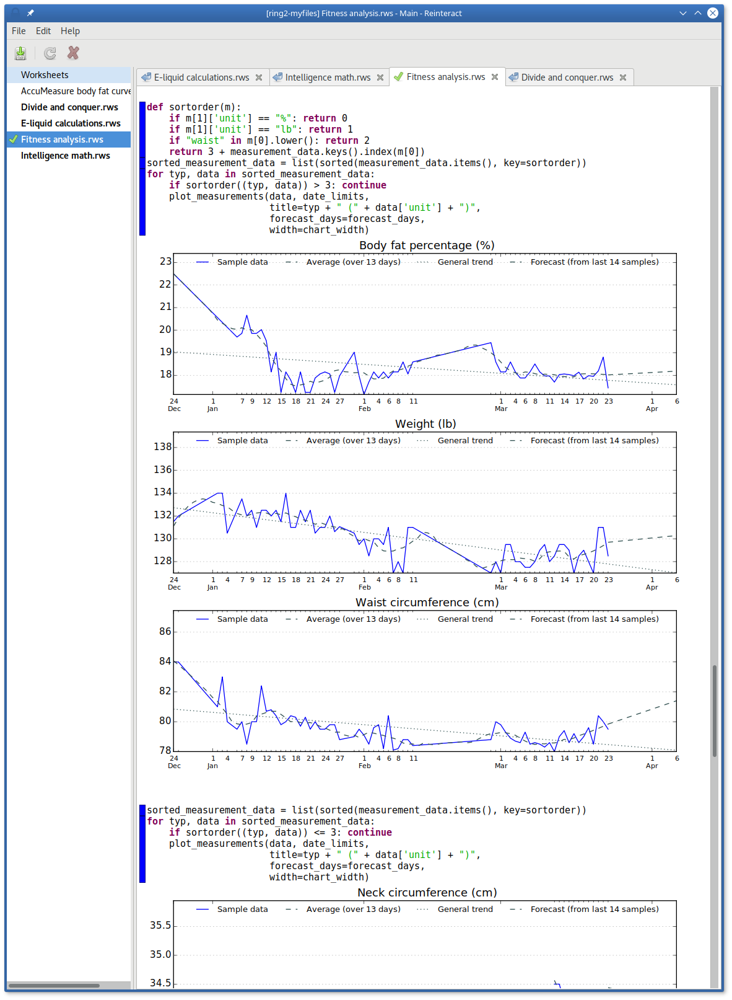
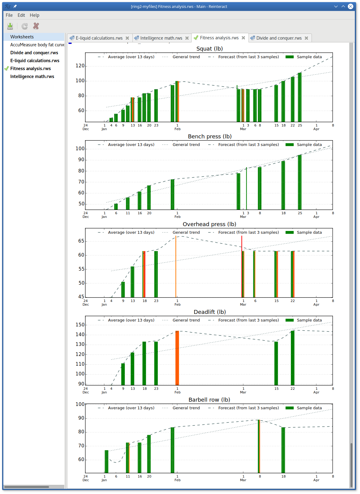

# Fitness workbench

This is a Python / Reinteract workbench that allows you to analyze daily measurements of your body and exercise progress using SciPy / NumPy / Matplotlib.  This workbench is far more useful for fitness data analysis than the most sophisticated spreadsheet tables, graphs and macros.

For a companion [set of formulas to use with your AccuMeasure body fat calipers, check this out](https://rudd-o.com/archives/body-fat-formulas-for-your-accumeasure-body-fat-calipers).

## Usage

Deploy Reinteract to your system.

Make sure NumPy and SciPy are installed as well.

Install [`ssconverter`](https://github.com/Rudd-O/ssconverter) so that the workbench may extract data from your fitness tracker spreadsheet.

Create your fitness tracker spreadsheet according to these instructions:

* Create a sheet named *Measurements tracker*.
  * The sheet must have the following labels starting at A1:
    *  Date  |  Measurement   |   Value     |       Unit     |        Notes
  * Start tracking measurements.  Each line on the table must describe a measurement (e.g. of your body).
  * For reference, each cell on the table starting at A2 must be in the following format:
    * date  /  string    /   float or formula   /    string    /     string
* Create a sheet named *Exercise tracker*.
  * The sheet must have the following labels starting at A1:
    * Date  |  Exercise name  |  Repetitions  |  Weight  |  Notes
  * Start tracking exercises.  Each line on the table must describe a set.
  * For reference, each cell on the table starting at A2 must be in the following format:
    * date  /  string     /   integer  /  float or formula  /      string
* Any other sheets are your own to do whatever you want with.

Adjust the variables at the top of the workbench to point the workbench to your fitness tracker spreadsheet.

Analyze to your heart's content.  Remember: this workbench is only a starting point.

## How does it look?

Take a look:

